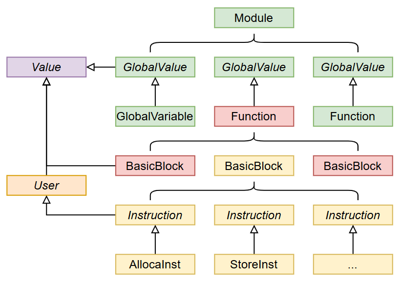
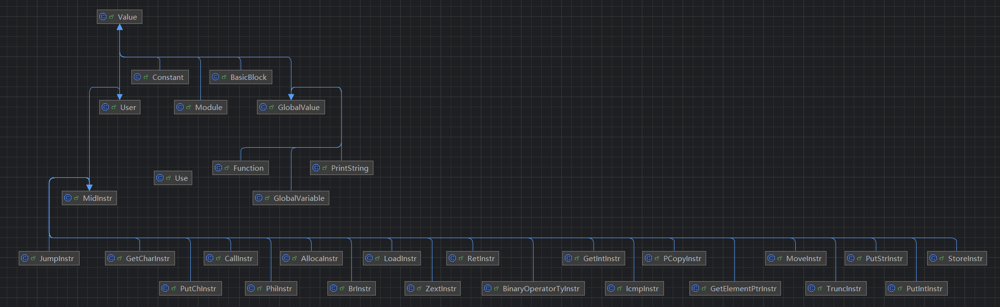
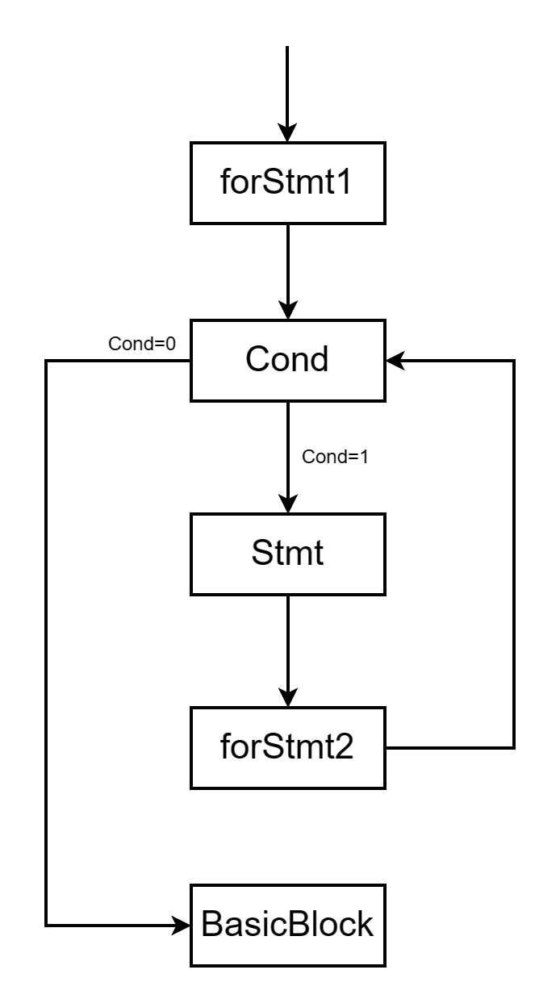
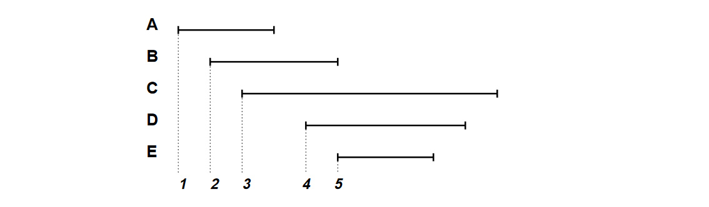
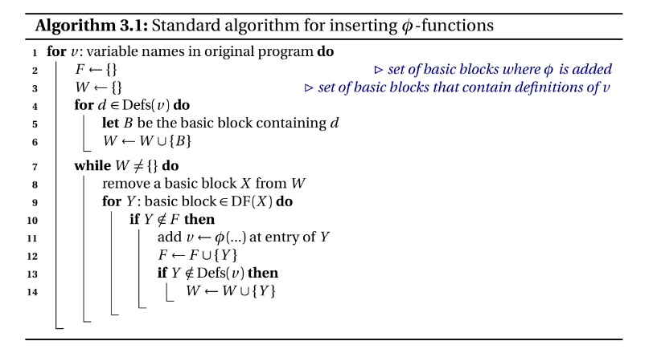

# SysY_Compiler——BUAA2024秋编译设计文档

下面各部分描述严格按照本人完成的顺序进行

### 总体结构

下面本编译器分为前端、中端和后端

- 前端：词法分析、语法分析、语义分析、错误处理
- 中端：LLVM IR代码优化，做了死代码删除（未使用的函数、不可达块、不可达函数）、Mem2Reg
- 后端：活跃变量分析、寄存器分配

代码结构如下：

```java
├─backend
│  ├─objInstr //各类目标代码
│  │  ├─branch
│  │  ├─dm
│  │  ├─global
│  │  ├─jump
│  │  ├─load
│  │  ├─move
│  │  ├─riCalculate
│  │  ├─rrCalculate
│  │  └─store
│  ├─optimize //后端优化
│  └─register //后端实际寄存器相关
├─frontend
│  ├─AST
│  │  └─SyntaxComponent // 语法树组成部分
│  ├─Error //各类错误
│  ├─Symbol //各类符号表
│  └─Token //token相关
└─llvm
    ├─initial //value的各类初始值
    ├─midInstr //各类中间代码
    │  ├─binaryOperatorTy
    │  ├─icmp
    │  └─io
    ├─midOptimize //中间代码优化
    └─type //llvm value的类型

```

具体结构见附录

整体代码架构如下在Compile.java即可看出各部分的接口

```java
TreeMap<Integer,String> errors = new TreeMap<>();

Lexer lexer = new Lexer();
String path = "testfile.txt";
StringBuilder input = new StringBuilder();
try (BufferedReader reader = new BufferedReader(new FileReader(path))) {
    String line;
    while ((line = reader.readLine()) != null) {
        input.append(line).append("\n");
    }
} catch (IOException e) {
    e.printStackTrace();
}
lexer.lexerIn(input.toString());
Parser parser = new Parser(lexer);
Node root = parser.parse();
//重定向输出到lexer.txt
try {
    System.setOut(new PrintStream(new FileOutputStream("lexer.txt")));
} catch (Exception e) {
    e.printStackTrace();
}
lexer.lexerOut();

//重定向输出到parser.txt
try {
    System.setOut(new PrintStream(new FileOutputStream("parser.txt")));
} catch (Exception e) {
    e.printStackTrace();
}
root.print();

//重定向输出到symbol.txt
root.checkErrors();
try {
    System.setOut(new PrintStream(new FileOutputStream("symbol.txt")));
} catch (Exception e) {
    e.printStackTrace();
}
SymbolManager.getInstance().print();

//重定向输出到error.txt
for (Error error : LexerErrors.getInstance().getErrors()) {
    errors.put(error.getLineNum(),error.getMessage());
}
for (Error error : ParserErrors.getInstance().getErrors()) {
    errors.put(error.getLineNum(),error.getMessage());
}
for (Error error : SymbolErrors.getInstance().getErrors()) {
    errors.put(error.getLineNum(),error.getMessage());
}
try {
    System.setOut(new PrintStream(new FileOutputStream("error.txt")));
} catch (Exception e) {
    e.printStackTrace();
}
for (Integer key : errors.keySet()) {
    System.out.println(key + " " + errors.get(key));
}

root.generateIR();
//重定向输出到IR.txt
try {
    System.setOut(new PrintStream(new FileOutputStream("llvm_ir_Ori.txt")));
} catch (Exception e) {
    e.printStackTrace();
}
System.out.println(LLVMBuilder.getLlvmBuilder().getModule().toString());

try {
    System.setOut(new PrintStream(new FileOutputStream("llvm_ir.txt")));
} catch (Exception e) {
    e.printStackTrace();
}
MidOptimize midOptimize = new MidOptimize(LLVMBuilder.getLlvmBuilder().getModule());
midOptimize.run();
System.out.println(LLVMBuilder.getLlvmBuilder().getModule().toString());

//重定向输出到mips.txt
try {
    System.setOut(new PrintStream(new FileOutputStream("mipsTemp.txt")));
} catch (Exception e) {
    e.printStackTrace();
}
LLVMBuilder.getLlvmBuilder().getModule().generateMips();
System.out.println(MipsBuilder.getMipsBuilder().getObjModule().toString());

try {
    System.setOut(new PrintStream(new FileOutputStream("mips.txt")));
} catch (Exception e) {
    e.printStackTrace();
}
System.out.println(MipsBuilder.getMipsBuilder().getObjModule(true).toString());
//将mips.txt复制到mips.asm
try {
    BufferedReader reader = new BufferedReader(new FileReader("mips.txt"));
    BufferedWriter writer = new BufferedWriter(new FileWriter("mips.asm"));
    String line;
    while ((line = reader.readLine()) != null) {
        writer.write(line);
        writer.newLine();
    }
    reader.close();
    writer.close();
} catch (IOException e) {
    e.printStackTrace();
}
```

整体思路如下：

- Lexer类将源程序读入并解析为token，并存储在该类中用于后续操作
- Parse类用于解析Lexer中存储的token，并根据文法通过递归向下构建抽象语法树
- 从语法树的根节点递归向下实现checkErrors并在这个过程中建立符号表，SymbolManager类用于管理符号表的作用域符号
- LexerErrors、ParserErrors、SymbolErrors实现各阶段分析所产生问题的储存
- 结束词法分析、语法分析、语义分析这一章后，就可以根据构建的语法树和符号表生成中间代码，思路依旧是从根节点递归向下生成中间代码（无优化版）
- 生成中间代码后将`Module`传入`MidOptimize`进行中间代码的各类优化
- 将所有llvm ir通过`generateMips`翻译为mips中间代码（在这个过程中只是单纯翻译中间代码、所需要的寄存器均为寄存器）
- `RegAllocator`根据第一遍生成的代码（mipsTemp.txt）进行寄存器分配和栈帧保留区、扩展区代码的插入

### 前端

#### 词法分析

和OO课的第一单元很像、只要弄清最小基本单元很简单、对着OO作业的架构几乎一遍通过。

我定义完Token类以及按照教程中给出的TokenType的Enum类后

```java
public class Token {
    private final int lineNum;
    private final TokenType type;
    private final String value;
}
```

遍历读入的字符串，只需用switch列出所有可能的字符，并实现对应的操作即可，如果读入的字符是字母，只需要将其读到尾部再使用switch穷举其可能遇到字符串。我没有使用任何正则匹配，任何相比其他方法，我认为这是一种高可维护性并且十分简单的代码，或许部分工作有些繁琐，例如下面的case可能特别多，code过程列完需要的操作，繁琐的操作完全可以扔给ai做。

```java
public void lexerIn(String input) {
        while (hasNext(input)) {
            char curChar = input.charAt(index);
            switch (curChar) {
                case ' ':
                    break;
                case '\n':
                    lineNum++;
                    break;
                case '+':
                    tokens.add(new Token(lineNum, TokenType.PLUS, "+"));
                    break;
                ……
                case '_': case 'a': case 'b': case 'c': case 'd': case 'e': case 'f': case 'g': case 'h': case 'i':
                case 'j': case 'k': case 'l': case 'm': case 'n': case 'o': case 'p': case 'q': case 'r': case 's':
                case 't': case 'u': case 'v': case 'w': case 'x': case 'y': case 'z': case 'A': case 'B': case 'C':
                case 'D': case 'E': case 'F': case 'G': case 'H': case 'I': case 'J': case 'K': case 'L': case 'M':
                case 'N': case 'O': case 'P': case 'Q': case 'R': case 'S': case 'T': case 'U': case 'V': case 'W':
                case 'X': case 'Y': case 'Z':
                    StringBuilder sb3 = new StringBuilder();
                    while (hasNext(input) && isIdentifier(input.charAt(index))) {
                        sb3.append(input.charAt(index));
                        index++;
                    }
                    index--;
                    String s = sb3.toString();
                    switch (s) {
                        ……
                        case "printf":
                            tokens.add(new Token(lineNum, TokenType.PRINTFTK, s));
                            break;
                        case "getchar":
                            tokens.add(new Token(lineNum, TokenType.GETCHARTK, s));
                            break;
                        default:
                            tokens.add(new Token(lineNum, TokenType.IDENFR, s));
                            break;
                    }
                    break;
            }
            index++;
        }
```

这个部分相对来说是我做的比较满意的部分，全程除了对 `'` 的处理有点bug外，几乎没有任何修改


#### 语法分析

这部分主要参考陈学长递归下降子程序和OO作业的思路，实现不是很难，重点还是熟悉文法

- 第一步，毫无疑问、根据理论课所学消除左递归

- 第二步，构造各个语法单元的类，其都继承`Node`类

  ```java
  public class Node {
      protected final int startLine;
      private final int endLine;
      protected final SyntaxType type;
      protected final ArrayList<Node> children;
  }
  ```

- 第三步，根据文法解析，这里要区分终结符和非终结符，这里以VarDecl为例介绍

  ```java
  // VarDecl ==> 'int'|'char' VarDef { ',' VarDef } ';'
  public Node parseVarDecl() {
      ArrayList<Node> children = new ArrayList<>();
  
      Node node;
      if (curToken.getType() == TokenType.INTTK || curToken.getType() == TokenType.CHARTK) {
          addTokenNode(children, curLineNum);
      } else {
          throw new RuntimeException("Expect 'int' or 'char' in VarDecl");
      }
      node = parseVarDef();
      children.add(node);
  
      while (lexer.getToken(curTokenIndex).getType() == TokenType.COMMA) {
          addTokenNode(children, curLineNum);
  
          node = parseVarDef();
          children.add(node);
      }
  
      if (lexer.getToken(curTokenIndex).getType() == TokenType.SEMICN) {
          addTokenNode(children, curLineNum);
      } else {
          ParserErrors.getInstance().addError(lexer.getToken(curTokenIndex - 1).getLineNum(), "i");
          addMissedNode(children, lexer.getToken(curTokenIndex - 1).getLineNum(), TokenType.SEMICN, ";");
      }
  
      int endLine = lexer.getToken(curTokenIndex - 1).getLineNum();
      return new VarDecl(curLineNum, endLine, SyntaxType.VarDecl, children);
  }
  ```

  从文法可以看出，各个组成部分应该是什么，如果是非中介符，需要继续调用非终结符的`parseVardef`方法，但是无论是终结符还是非终结符都需要加入该节点的子节点中去，因为语法分析还需要进行错误处理，所以还需要进行终结符的特判来识别i、j、k类错误，为了快速定位错误，我也在一些地方进行了抛出异常来处理某些地方token的过读。

- 最后，按照要求进行遍历输出即可


#### 语义分析

这里虽然写的很顺利，但是我也在这一部分作为单独一次作业是否合理，也许是我的调研不够充分，如果单纯为了实现实验任务，这里的只有两项任务——递归向下进行错误处理，建立栈式符号表输出对应内容

我建立的符号表如下：

```java
public class SymbolManager {
    private static final SymbolManager instance = new SymbolManager();
    private final Stack<SymbolTable> symbolTables;
    private int loopDepth;
    private int scopeNum; // 作用域序号
    private FuncSymbol lastFuncSymbol;
    private final TreeMap<Integer, SymbolTable> symbolTableList;
}
```

采用单例模式，在对语法树递归向下`CheckErrors`时进行符号表的管理，针对不同符号，我建了`ArraySymbol`,`ConstArraySymbol`,`ConstVarSymbol`,`FuncSymbol`和`VarSymbol`五个子类，实现针对不同符号的不同处理，在输出时直接将其`toString()`即可


**错误处理**

要做的事情大致分为以下

- 更新符号表
  - 更新当前函数
  - 更新当前block
  - 更新当前循环层数
- 检查根据描述检查各类错误——缺少return、重命名等

针对不同节点，实现checkErrors即可


这部分架构后续没做太多更改，bug主要出在一下几个方面

- printf里面的%d和%c与参数个数的检查
- 语法分析未对缺失的符号进行补全，导致后续涉及对节点数目的判断出现问题
- Stmt语句`LVal '=' Exp ';'` 和 `[Exp] ';'`的First集合冲突问题，这里我采用的是遍历提前读的方式来予以区分

做完上述工作足以通过语法分析的测试，但在后续生成LLVM的过程才发现这里我做的只能概括为——为了输出而输出


### 中端

#### llvm代码生成

难+工作量大，由于前期符号表建立的不足，后续又对符号表进行了加工，增加了一些方法。下面介绍代码按照个人完成的顺序进行。

初学LLVM，对指令并不熟悉，按照教材中创建了对应的类，继承关系严格按照教程中的这张图



1. 

针对中间代码生成，这一步创建对应的类后，实现各个类的toString方法，以`Alloca`指令为例

```java
@Override
public String toString() {
	return name + " = alloca " + targetType.toString();
}
```

其实最开始写的时候，对于“`User` 和 `Value` 之间的配对用 `Use` 类记录，通过 `Use` 类建立起了语法结构的上下级关系双向索引。这样所有的语法结构都可以统一成 `Value` 类，语法结构间的使用关系都可以统一成 `Use` 类。”我并不是很理解，只是知道应该这么做，知道优化的时候才发现其作用。参考学长代码我发现可以通过新建对象时就将其加入BasicBlock和更新User

```java
public MidInstr(LLVMType type, String name, MidInstrType instrType) {
    super(type, name);
    this.instrType = instrType;
    parentBasicBlock = null;
    LLVMBuilder.getLlvmBuilder().addInstruction(this);
}
```

```java
public void addOperand(Value operand) {
    operands.add(operand);
    if (operand != null) {
    operand.addUse(this);
    }
}
```

```java
public AllocaInstr(String name, LLVMType targetType) {
    super(new PointerType(targetType), name, MidInstrType.ALLOCA);
    this.targetType = targetType;
}
```



针对指令的类型，我参考了学长的写法，也实现了`ArrayType`,`BoolType`,`Int8Type`,`Int32Type`,`OtherType`,`PointerType`和`VoidType`,并定义了一个枚举类来区分其类型

针对常量和全局变量的初始值，我使用了两个子类ArrayInitial和VarInitial（继承Initial类，initial类继承Value）来作为常量和全局变量的初值。

**生成llvm**

完成各个类的创建后，接下来就是中间代码生成中最难的部分，由语法树——生成对应的llvm ir代码，大体思路还是按照语法树递归向下，为节点实现`generateMips`方法

我实现了LLVMBuilder类，主要用于生成变量名、为当前Function生成BasicBlock，为当前BasicBlock生MidInstr。

```java
private static final LLVMBuilder llvmBuilder = new LLVMBuilder();
private static int registerCounter = 0; // 虚拟寄存器编号
private static int printStringCounter = 0; // 输出字符编号
private static int branchCounter = 0; // 分支名编号
private Module module;
private Function curFunction;
private BasicBlock curBasicBlock;
private Stack<Loop> loopStack;
```

命名方面，最开始我是按照%1,%2这种命名方式，后来发现无法保证严格递增的条件，索性把虚拟寄存器加个v，给分支加个branch这样就可以通过语法检查，也方便分别储存。

代码生成方面，比较难的部分就是for循环



针对这张图，需要针对每个创建BasicBlock和对每个Block生成mips，同时需要记录,在最开始，我采用纯数字对分支名进行编号时为了保证其顺序，再加入后又对其进行了删除，从而使得后续编号在这些block后面，也保证了Block的出现符合逻辑

```java
                BasicBlock condBlock = new BasicBlock(LLVMBuilder.getLlvmBuilder().getBranchName());
                BasicBlock bodyBlock = new BasicBlock(LLVMBuilder.getLlvmBuilder().getBranchName());
                BasicBlock updateBlock = new BasicBlock(LLVMBuilder.getLlvmBuilder().getBranchName());
                BasicBlock exitBlock = new BasicBlock(LLVMBuilder.getLlvmBuilder().getBranchName());

                LLVMBuilder.getLlvmBuilder().getLoopStack().push(new Loop(condBlock, bodyBlock, updateBlock, exitBlock));

                LLVMBuilder.getLlvmBuilder().removeBasicBlock(bodyBlock.getName());
                LLVMBuilder.getLlvmBuilder().removeBasicBlock(updateBlock.getName());
                LLVMBuilder.getLlvmBuilder().removeBasicBlock(exitBlock.getName());

```

#### 后期修改

由于前期对getElementPtr指令的理解有误，导致一些数据类型错误，后面我找了相关定义GetElementPtr指令是一条指针计算语句，本身并不进行任何数据的访问或修改，只进行指针的计算。使用语法如下：

```java
<result> = getelementptr <ty>, <ty>* <ptrval>{, [inrange] <ty> <idx>}*
<result> = getelementptr <ty>, <ptr vector> <ptrval>, [inrange] <vector index type> <idx>
```

**小结**

LLVM中间代码上手难度十分不易，debug也花了很长时间，但是在IDEA的控制台用wsl做好代码的测试也比较方便，下面是我的测试程序，每次生成完用wsl跑看报错，真的很方便！！！

```shell
cd ..
cat llvm_ir.txt > ./testLLVM/out.ll
cat llvm_ir.txt > ./testLLVM/llvm_ir.ll

cat testfile.txt > ./testLLVM/main.c
cd ./testLLVM

llvm-link out.ll lib.ll -S -o out.ll
lli out.ll < in.txt
```

### 后端生成Mips代码

做完中间代码生成后，我做了无优化版本的mips代码生成，由于我采用的是先生成虚拟寄存器，这部分的难点在于栈帧的分配，我的栈帧分配如下：

```java
/*
    |-------------------------|
    |----------ext------------|
    |-------------------------|
    |---------local-----------|
    |-------------------------|
    |----------save-----------|
    |-------------------------|
    |-----------ra------------|
    |-------------------------|
    |----------para-----------|
    |-------------------------|
 */
```

由于某些原因，我没有采用任何对齐，所有的值均按照四字节存储

- para区：存放当前函数调用其他函数的实参，我并没有将\$a0-\$a3这些进行存储，但是为其开辟了空间，尽管最后也没有使用到，大小为该函数调用的所有$(函数参数的最大值)* 4$，这样可以方便被调用函数获取实参，只需要原来偏移量加上当前函数的大小fSize
- ra：存放函数返回值$ra
- sava保留区：存放函数调用时需要存起来的寄存器，大小由我分配的全局寄存器数目决定
- local：本地值的存放处，如alloca指令
- ext扩展区：存放后续保留中间计算结果的位置，例如，没有空闲寄存器时我们需要将计算结果保存在内存里，那么这篇区域就成了我们保存的对象

弄清上述东西花费了我大部分时间，接下来就是和llvm代码一样，对所有MidInstr实现`generateMips`方法进行翻译，并用`MipsBuilder`类实现指令添加、生成虚拟寄存器、计算栈帧偏移量

#### 无优化版本

我的第一遍仅仅分了.text和.data段用于存放各类目标代码，然后遍历代码，分配`$t0`和`$t1`寄存器，没有为目标代码分配，后端的代码结构较为简单，没有实现后续使用的`ObjModule`,`ObjFunction`,`ObjBlock`这些类。

分配寄存器采用的方式较为暴力，遍历所有指令进行相应的指令插入和函数开头的`$sp`相关偏移量计算

```java
    public void allocateRegister() {
        int funCount = 0;
        String funcName = "";
        for (ObjInstr instr : textSegment) {
            int a = 1;
            if (instr instanceof ObjCommentInstr) {
                if (((ObjCommentInstr) instr).getComment().startsWith("enter function")) {
                    if (funCount != 0) {
                        Fun2Offset.put(funcName, curOffset);
                    }
                    funcName = ((ObjCommentInstr) instr).getComment().substring(15);
                    funCount++;
                    curOffset = Fun2Offset.get(funcName);
                }
            } else if 
             /*
                省略一堆else if
             */
               
            else if (instr instanceof ObjLiInstr) {
                Register target = ((ObjLiInstr) instr).getTarget();
                if (!target.isRealRegister()) {
                    toAddPut(textSegment.indexOf(instr) + 1, new ObjStoreInstr(StoreType.SW, Register.get$t0(), Register.get$sp(), curOffset, true));
                    frame.put(curOffset, target.getVirtualReg());
                    addStackFrameValue(Register.get$t0());
                    target.setRealRegister(RealRegister.T0);
                }
            }
        }
        Fun2Offset.put(funcName, curOffset);
        for (int i = toAdd.size() - 1; i >= 0; i--) {
            for (Integer index : toAdd.get(i).keySet()) {
                textSegment.add(index, toAdd.get(i).get(index));
            }
        }
        toAdd.clear();
    }
```

这部分的难点主要在以下两点

1. 认识到破坏\$a0,\$a1,\$a2,\$a3的行为：

   - 系统调用

   - 函数调用
2. 如何找到对应虚拟寄存器在内存中的位置——采用HashMap对其进行实时更新

最后竞速结果如下


#### 优化版本

##### 后端优化

###### 寄存器分配

由于只有两个寄存器着实影响效率，所以寄存器分配是我最先做的部分，最开始研究了图着色算法，其构建图的过程过于繁琐，对于时间不多的我来说可谓雪上加霜，于是我用了线性分配，主要参考这篇文章：

https://www.cnblogs.com/AANA/p/16315921.html

核心思路就是创建寄存器池，并根据变量的活跃区间进行寄存器的分配和释放

|      |    active intervals    | available registers | spilled intervals |   allocation results   |
| ---- | :--------------------: | :-----------------: | :---------------: | :--------------------: |
| 初始 |          {}{}          |   {r1,r2}{r1,r2}    |       {}{}        |          {}{}          |
| A    |      {A=r1}{A=r1}      |      {r2}{r2}       |       {}{}        |          {}{}          |
| B    | {A=r1,B=r2}{A=r1,B=r2} |        {}{}         |       {}{}        |          {}{}          |
| C    | {A=r1,B=r2}{A=r1,B=r2} |        {}{}         |      {C}{C}       |          {}{}          |
| D    | {D=r1,B=r2}{D=r1,B=r2} |        {}{}         |      {C}{C}       |      {A=r1}{A=r1}      |
| E    | {D=r1,E=r2}{D=r1,E=r2} |        {}{}         |      {C}{C}       | {A=r1,B=r2}{A=r1,B=r2} |
| 结束 |          {}{}          |   {r1,r2}{r1,r2}    |      {C}{C}       | {A=r1,B=r2,D=r1,E=r2}  |

活跃区间如下：



我做的活跃区间是按照行数进行，判断当前行数是否是该虚拟寄存器可以释放

1. 在循环中的虚拟寄存器，在块结束统一判断
2. 不在循环中，直接更新endline


###### 变量活跃分析和CFG流图构建

在进行寄存器分配前需要进行活跃变量分析，由于CFG图在中端已经生成，这里要做的其实只有根据中端生成的重新构建一下即可

```java
public void BuildCFG() {
        HashMap<BasicBlock, ArrayList<BasicBlock>> preMap = llvmFunction.getPreMap();
        HashMap<BasicBlock, ArrayList<BasicBlock>> sucMap = llvmFunction.getSucMap();
        for (BasicBlock block : preMap.keySet()) {
            //……
        }
        for (BasicBlock block : sucMap.keySet()) {
            //……
        }
    }
```

**活跃变量分析**

根据编译理论里的公式即可
$$
out[B] =  \cup _{B的所有后继} in[B]
\\
in[B] = use[B] \cup (out[B] - def[B])
$$

```java
 while (changed) {
            changed = false;
            for (int i = blocks.size() - 1; i >= 0; i--) {
                ObjBlock bb = blocks.get(i);
                HashSet<String> newOut = new HashSet<>();
//                out = U后继(in)
                for (ObjBlock succ : bb.getSuccessors()) {
                    newOut.addAll(inMap.get(succ));
                    outMap.put(bb, newOut);
                }
//                in = (out - def) + use
                HashSet<String> newIn = new HashSet<>(newOut);
                newIn.removeAll(bb.getDef());
                newIn.addAll(bb.getUse());
                if (!newIn.equals(inMap.get(bb))) {
                    changed = true;
                    inMap.put(bb, newIn);
                }
            }
        }
```

###### 删除非活跃变量

这个的优化效果不佳，建议还是建议在中端根据def-use的数据流进行删除死代码，思路也比较简单：根据目标代码是否存在活跃区间进行删除，下面以rr类型指令为例

```java
else if (instr instanceof ObjRRCalculateInstr objRRCalculateInstr) {
    Register rd = objRRCalculateInstr.getRd();
    if (!activeMap.containsKey(rd.toString()) && !rd.isRealRegister()) {
        iterator.remove();
    }
}
```

###### 删除只有j指令的ObjBlock

针对包含label的指令执行dfs

```java
public String dfs(ObjFunction objFunction, ObjBlock objBlock, HashSet<ObjBlock> removeBlocks, String label) {
        ObjBlock nextBlock = objFunction.getBlockByLabel(label);
        if (nextBlock == null) {
            return label;
        }
        if (nextBlock.getInstructions().size() == 1 && nextBlock.getInstructions().get(0) instanceof ObjJumpInstr objJumpInstr && objJumpInstr.getJumpType() == JumpType.J) {
            removeBlocks.add(nextBlock);
            return dfs(objFunction, nextBlock, removeBlocks, objJumpInstr.getLabel());
        } else {
            return label;
        }
    }
```

##### 中端优化

做完寄存器分配后，竞速排序的结果相比原来快了很多


###### 消除不可达块

通过branch指令和jump指令对所有块进行dfs，记录下不可达块并对其进行删除

```java
public void dfsBlock(BasicBlock block, HashSet<BasicBlock> visited) {
        visited.add(block);
        MidInstr lastInstr = block.getInstructions().get(block.getInstructions().size() - 1);
        if (lastInstr instanceof BrInstr) {
            BasicBlock thenBlock = (BasicBlock) ((BrInstr) lastInstr).getOperands().get(1);
            BasicBlock elseBlock = (BasicBlock) ((BrInstr) lastInstr).getOperands().get(2);
            if (!visited.contains(thenBlock)) {
                dfsBlock(thenBlock, visited);
            }
            if (!visited.contains(elseBlock)) {
                dfsBlock(elseBlock, visited);
            }
        } else if (lastInstr instanceof JumpInstr jumpInstr) {
            BasicBlock targetBlock = (BasicBlock) jumpInstr.getOperands().get(0);
            if (!visited.contains(targetBlock)) {
                dfsBlock(targetBlock, visited);
            }
        }
    }
```

###### 消除死代码

根据Use进行删除，没有use的指令直接删除

```java
 MidInstr instr = instrIterator.next();
if (canBeUse(instr) && instr.getUseList().isEmpty()) {
    instrIterator.remove();
}
```

###### 乘除法优化

在生成mips时做的优化，做的比较简单，对参与计算的value进行特判

```java
if (constant1 != null && constant2 != null) {
    new ObjLiInstr(ans, constant1 * constant2);
} else if (constant1 != null) {
    //                    如果constant1可以被2的幂整除
    if ((constant1 & (constant1 - 1)) == 0) {
        new ObjRICalculate(RICalculateType.SLL, ans, rt, Integer.numberOfTrailingZeros(constant1));
    } else {
        rs = new Register(VirtualRegister.getVirtualRegister().getRegister());
        new ObjLiInstr(rs, constant1);
        new ObjDmInstr(DmType.MULT, rs, rt);
        new ObjMoveHLInstr(MoveType.MFLO, ans);
    }
} else if (constant2 != null) {
    if ((constant2 & (constant2 - 1)) == 0) {
        new ObjRICalculate(RICalculateType.SLL, ans, rs, Integer.numberOfTrailingZeros(constant2));
    } else {
        rt = new Register(VirtualRegister.getVirtualRegister().getRegister());
        new ObjLiInstr(rt, constant2);
        new ObjDmInstr(DmType.MULT, rs, rt);
        new ObjMoveHLInstr(MoveType.MFLO, ans);
    }
} else {
    new ObjDmInstr(DmType.MULT, rs, rt);
    new ObjMoveHLInstr(MoveType.MFLO, ans);
}
```


###### Mem2Reg

**准备工作**

这部分是中端优化的主要部分包含构建支配图和支配边界，我们需要根据基本块之间的跳转关系构建出控制流图、支配树，并计算出每个节点的支配边界。这部分主要参考[Petrichor/src/mid_end/CFGBuilder.java at master · Hyggge/Petrichor](https://github.com/Hyggge/Petrichor/blob/master/src/mid_end/CFGBuilder.java)，架构确实好！！

```java
public void run() {
        for (Function function : module.getFunctions()) {
            init(function);
            buildCFG(function);
            buildDominator(function);
            buildImmDominator(function);
            buildDF(function);
            for (BasicBlock basicBlock : function.getBasicBlocks()) {
                basicBlock.setDefUse();
            }
        }
    }
```

**插入phi**

找出需要添加phi指令的基本块，并添加phi，插入算法



```java
public void insertPhi() {
        HashSet<BasicBlock> F = new HashSet<>();
        Stack<BasicBlock> W = new Stack<>();
        for (BasicBlock block : defBlocks) {
            W.push(block);
        }
        while (!W.isEmpty()) {
            BasicBlock X = W.pop();
            for (BasicBlock Y : X.getDominanceFrontiers()) {
                if (!F.contains(Y)) {
                    generatePhi(Y);
                    F.add(Y);
                    if (!defBlocks.contains(Y)) {
                        W.push(Y);
                    }
                }
            }
        }
    }
```

随后通过DFS进行重命名，同时将相关的alloca, store,load这些内存指令删除，

前序遍历支配树，对于每个基本块，顺序指令

- 如果遇到了alloca指令，记录下alloca的指针名，为该指针建立一个空堆栈，删除该指令
- 如果遇到了store指令，将需要写入内存的Value压入指针对应的堆栈，删除该指令
- 如果遇到了load指令，那么将所有使用该load指令对应Value的指令，改为使用指针对应堆栈的栈顶Value，删除该指令
- 如果遇到了phi指令，则将该指令对应的Value压入指针对应的堆栈。

每次结束后需要对phi指令加上选项以及将堆栈中新加入的弹出

**删除phi**

这部分由于后续分配寄存器的原因我不太想放在后端做，所以我在中端引入了move指令（llvm实际没有）

```java
public void run() {
    for (Function function : module.getFunctions()) {
        Phi2PCopy(function);
        RemovePhi2Move(function);
    }
}
```

这里要做的就是将phi指令变为pcopy指令，而pcopy指令就是一堆并行move指令的集合（所以这里重点就是如何让把实际并行的指令在并行执行下不会出错和正确放置pcopy指令），大致步骤如下：

1. `Phi2Pcopy`：将phi指令转化为Pcopy指令，针对某一ObjBlock，遍历其前前继，分析其前继B的后继数目

   - 如果B的后继数目为1，直接将Pcopy指令插在B的跳转指令前
   - 反之，需要新建一个ObjBlock过渡，并在这里块内插入Pcopy指令

   最后根据phi指令进行Pcopy指令的修改

2. `RemovePhi2Move`：将Pcopy指令转换为一堆move指令——遍历寻找Pcopy指令即可，针对冲突指令，我采用HashMap解决，通过增加中间变量的Move指令解决

```java
// 并行指令检查冲突赋值——某一dst在后面的src中出现
HashMap<Value, Value> conflict = new HashMap<>();
for (int i = 0; i < moveInstrs.size(); i++) {
    for (int j = i + 1; j < moveInstrs.size(); j++) {
        if (moveInstrs.get(i).getOperands().get(0).equals(moveInstrs.get(j).getOperands().get(1)) && !conflict.containsKey(moveInstrs.get(i).getOperands().get(0))) {
            conflict.put(moveInstrs.get(i).getOperands().get(0), new Value(Int32Type.getInstance(), LLVMBuilder.getLlvmBuilder().getVarName()));
        }
    }
}
for (Value value : conflict.keySet()) {
    moveInstrs.add(0, new MoveInstr(conflict.get(value), value));
    for (int i = 0; i < dsts.size(); i++) {
        if (dsts.get(i).equals(value)) {
            dsts.set(i, conflict.get(value));
        }
    }
}
```

#### 总结

最终版优化结果如下：


总的来说寄存器分配活跃区间的计算还可以进一步优化，按照我的写法，活跃区间只有一段，代码过长时，寄存器不太够用，后续考虑可以分为多段进行，当然最优还是图着色算法。

就评测点而言，mem2Reg和寄存器分配是降低总的circle最有效的优化，也是花费时间最长的两个优化。

编译全过程中总体来说架构较好，中间一次重构是从无优化版本到完成寄存器版本的优化对后端代码进行了优化，使得后端代码结构尽可能贴近中端。


### 参考

1. [Hyggge/Petrichor: Java 实现的 SysY - LLVM IR 编译器](https://github.com/Hyggge/Petrichor)
2. [Thysrael/Pansy: 一个简单的编译 SysY 语言（C 语言子集）到 Mips 的编译器，采用 Java 实现。](https://github.com/Thysrael/Pansy)
3. https://www.cnblogs.com/AANA/p/16315921.html
4. [educg-net-12619-928705 / Compiler2022-MeowCompiler · GitLab](https://gitlab.eduxiji.net/educg-group-12619-928705/compiler2022-meowcompiler)


### 附录

#### 代码结构

```java
│-Compiler.java
│-config.json
│
├─backend
│  │  BackOptimize.java
│  │  MipsBuilder.java
│  │  ObjBlock.java
│  │  ObjFunction.java
│  │  ObjModule.java
│  │
│  ├─objInstr
│  │  │  ObjCommentInstr.java
│  │  │  ObjInstr.java
│  │  │  ObjJRInstr.java
│  │  │  ObjLabelInstr.java
│  │  │  ObjLaInstr.java
│  │  │  ObjLiInstr.java
│  │  │  ObjMoveInstr.java
│  │  │  ObjNopInstr.java
│  │  │  ObjSyscallInstr.java
│  │  │
│  │  ├─branch
│  │  │      BranchType.java
│  │  │      ObjBranchInstr.java
│  │  │
│  │  ├─dm
│  │  │      DmType.java
│  │  │      ObjDmInstr.java
│  │  │
│  │  ├─global
│  │  │      ObjAsciizInstr.java
│  │  │      ObjByteInstr.java
│  │  │      ObjSpaceInstr.java
│  │  │      ObjWordInstr.java
│  │  │
│  │  ├─jump
│  │  │      JumpType.java
│  │  │      ObjJumpInstr.java
│  │  │
│  │  ├─load
│  │  │      LoadType.java
│  │  │      ObjLoadInstr.java
│  │  │
│  │  ├─move
│  │  │      MoveType.java
│  │  │      ObjMoveHLInstr.java
│  │  │
│  │  ├─riCalculate
│  │  │      ObjRICalculate.java
│  │  │      RICalculateType.java
│  │  │
│  │  ├─rrCalculate
│  │  │      ObjRRCalculateInstr.java
│  │  │      RRCalculateType.java
│  │  │
│  │  └─store
│  │          ObjStoreInstr.java
│  │          StoreType.java
│  │
│  ├─optimize
│  │      RegAllocator.java
│  │      RemoveBlockByJ.java
│  │
│  └─register
│          RealRegister.java
│          Register.java
│          VirtualRegister.java
│
├─frontend
│  │  Lexer.java
│  │  Parser.java
│  │  SymbolManager.java
│  │
│  ├─AST
│  │  │  ExpValueType.java
│  │  │  Node.java
│  │  │  SyntaxType.java
│  │  │
│  │  └─SyntaxComponent
│  │          AddExp.java
│  │          Block.java
│  │          Character.java
│  │          CompUnit.java
│  │          Cond.java
│  │          ConstDecl.java
│  │          ConstDef.java
│  │          ConstExp.java
│  │          ConstInitVal.java
│  │          EqExp.java
│  │          Exp.java
│  │          ForStmt.java
│  │          FuncDef.java
│  │          FuncFParam.java
│  │          FuncFParams.java
│  │          FuncRParams.java
│  │          FuncType.java
│  │          InitVal.java
│  │          LAndExp.java
│  │          LOrExp.java
│  │          LVal.java
│  │          MainFuncDef.java
│  │          MulExp.java
│  │          Number.java
│  │          PrimaryExp.java
│  │          RelExp.java
│  │          Stmt.java
│  │          TokenNode.java
│  │          UnaryExp.java
│  │          UnaryOp.java
│  │          VarDecl.java
│  │          VarDef.java
│  │
│  ├─Error
│  │      Error.java
│  │      LexerErrors.java
│  │      ParserErrors.java
│  │      SymbolErrors.java
│  │
│  ├─Symbol
│  │      ArraySymbol.java
│  │      ConstArraySymbol.java
│  │      ConstVarSymbol.java
│  │      FuncSymbol.java
│  │      Symbol.java
│  │      SymbolTable.java
│  │      ValueType.java
│  │      VarSymbol.java
│  │
│  └─Token
│          Token.java
│          TokenType.java
│
└─llvm
    │  BasicBlock.java
    │  Constant.java
    │  Function.java
    │  GlobalValue.java
    │  GlobalVariable.java
    │  LLVMBuilder.java
    │  Loop.java
    │  Module.java
    │  PrintString.java
    │  Use.java
    │  User.java
    │  Value.java
    │
    ├─initial
    │      ArrayInitial.java
    │      Initial.java
    │      VarInitial.java
    │
    ├─midInstr
    │  │  AllocaInstr.java
    │  │  BrInstr.java
    │  │  CallInstr.java
    │  │  GetElementPtrInstr.java
    │  │  JumpInstr.java
    │  │  LoadInstr.java
    │  │  MidInstr.java
    │  │  MidInstrType.java
    │  │  MoveInstr.java
    │  │  PCopyInstr.java
    │  │  PhiInstr.java
    │  │  RetInstr.java
    │  │  StoreInstr.java
    │  │  TruncInstr.java
    │  │  ZextInstr.java
    │  │
    │  ├─binaryOperatorTy
    │  │      BinaryOp.java
    │  │      BinaryOperatorTyInstr.java
    │  │
    │  ├─icmp
    │  │      IcmpInstr.java
    │  │      IcmpOp.java
    │  │
    │  └─io
    │          GetCharInstr.java
    │          GetIntInstr.java
    │          PutChInstr.java
    │          PutIntInstr.java
    │          PutStrInstr.java
    │
    ├─midOptimize
    │      BlockRelationBuilder.java
    │      DelDeadBlock.java
    │      DelDeadCode.java
    │      Mem2Reg.java
    │      MidOptimize.java
    │      RemovePhi.java
    │      UpdateBlock.java
    │
    └─type
            ArrayType.java
            BoolType.java
            Int32Type.java
            Int8Type.java
            LLVMEnumType.java
            LLVMType.java
            OtherType.java
            PointerType.java
            VoidType.java
```

